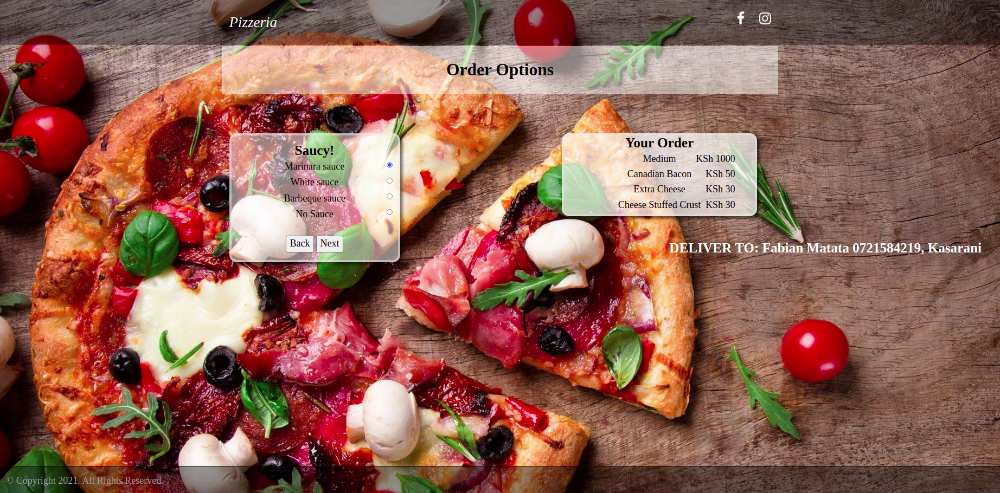

## Project Name
Pizzeria
## Project Description
Web application to help potential clients order for pizza online selecting size, crust, topping and if to have it delivered or to pick it up.
## Project Author
Fabian Matata
## Screenshot

## Project Live Link
https://fabianmatata.github.io/pizzeria/
## Technology Used
HTML, JS, CSS, Bootstrap
## Known Bugs
All the bugs that arised during the software development were fixed successfully.

## Installation Instructions
To install the above project in your computer you first have to download it, after which you can run it on your local computer.
## Contact & License Information 
Permission is hereby granted for free to any person obtaining a copy of this software and its associated documentation to use it without restriction be it for educational or commercial purposes. The software is provided 'as it is' without warranty of any kind, express or implied and the author is not liable for any claim, damages or other liability arising from the use or in connection to this software.

Copyright (c) 2021 Fabian Matata